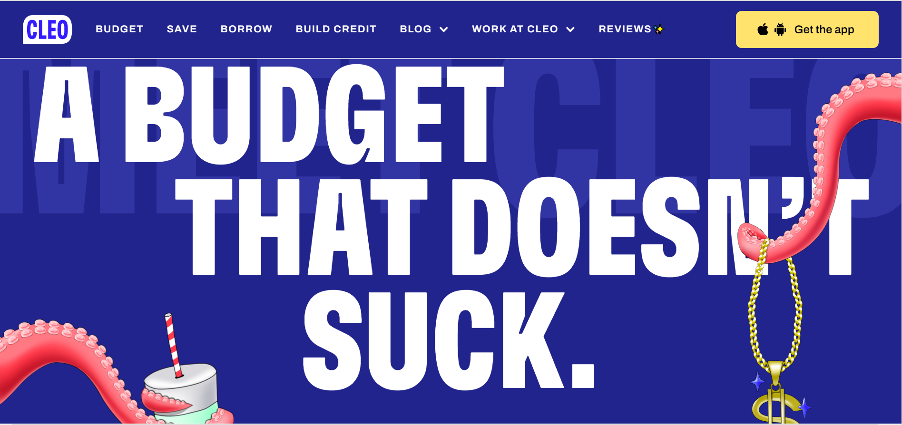
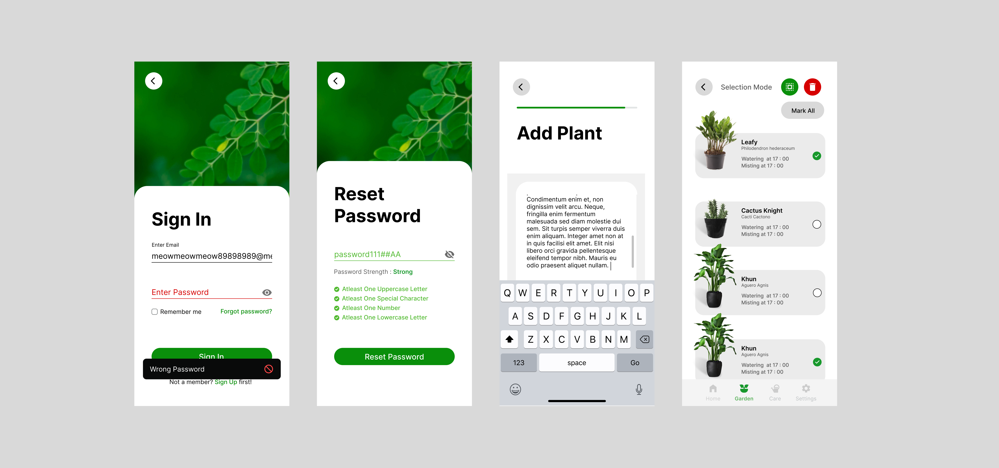

# Plantime Design Report

## **Inspiration**

Let us start by seeing how I came upon the idea to make this app's design in the hopes I make an app based on this design in future. When I went back to my home in the holidays I saw that the only two plants that we had were dead.

The **main idea** that I had was that at the end of the day people might forget to water their plants and kill them off, thus to help these people I decided to design an app that would give watering reminders. Below, I have expanded on the use cases of this app idea.

## **Non-Visual Development**

Let us first see all the decisions that were taken in the non-visual phase of process. In here, I will be discussing mainly the design decisions that were taken in the phase and if they were changed later, I will mention that in brief as detailed discussion of the changes will be in that particular phase.

### **Research and Audience Rationale**

After an app idea is concieved, we need to further think about the main functions it will provide as well the user groups that it will be targeting and in turn we must also satisfy the client demands though there were none in this case.

As mentioned after the app idea, I came up with four main functions that I thought my app was going to do as a part of the idea. Following below are those ideas in descending importance.

### **Main Functions in Descending Importance**

1. Will give reminders about watering the plant primarily in the form of noticifications and alarms.

2. Some sort of space to add, manage and delete all the plants and their data that the user wants to keep track of with the help of the app at the same place.

3. Additional features like optional reminders for misting.

4. Other features like backing up data, filtering out plants according to searches, setting up dates and time alarms ahead in time etc.

>It's important to note that it's not necessary for the final product to contain all of these functions. It just needs to have some of them because some of them would get eliminated depending upon some factors and the sooner they get eliminated or modified the lesser the financial loss is.

### **Target Audience**

Every app *starts out by targeting some specific user groups*, some apps or websites necessarily target only certain user groups and makes their websites and app that would suit the users from their user groups. 

The point is that the main user groups that are going to first use my app first must have a great experience according to them. I could streamline the experience for everybody but must make sure that for my target user groups I provide the best experience that I can. Because they are the people that I need to impress so that they would popularise my app. 

**Thus, we must identify such user groups and their goals that they would like to achieve with my app if they decided to use it.** Thus, following are the user groups.

### **Potential User Roles**

1. People who love plants and trees and the nature around them to some degree.

2. People who like to decorate their houses or other places with plants and like to have a hobby to divert their mind from other stressful things in life.

3. People who are extremely careful of their time and want their time at the right place with such a hobby would want their time to perfectly managed.

4. People who want to avoid hiring a gardener of some sort.

Particularly an ideal user profile may be : Ken Lock. He is 25 years old. Lives in States, earns 120k, likes nature and loves to go out on walks in parks. Rather loves living in apartments.

### **Checking out the Competition**

A Designer must after all of this must check out the competition that is out there in the real world so as to find if there are some functions or design components that must be included no matter what and if there are some things that must not be included. Generally the competition must be checked out to get some sense about the visual direction as well. 

This is what I did, I checked out some apps on playtstore and found that people were complaining about **data backup** which I decided to add in my app. I also found that people that just wanted to use the app quickly and didn't want to waste time didn't want to fill a note or whatsoever so I decided to make the **notes aspect hidden until needed**. In fact, after testing out some of the apps myself, I found that some of the apps had **glitches with respect to long plant names** which I also addressed in my app.

>I also looked at few designs and by chance came over this website [Cleo](https://web.meetcleo.com/) which made my visual direction quite specific much early. More about that in the third phase. 

In fact much of my content options came from the research phase as I was exposed to things that I had not thought about in my app or had taken for granted like Settings, I forgot that I would need a settings screen as I had an early approach of putting alarm and noticification settings in the same place as the plant card. 

And with all of that non-visual development sort of comes to an end, as we move onto content mapping and interaction mapping in the next section.

## **Semi-Visual Development**

This is where some part of designing starts until now we had been doing ideation, articulation and development only. Now we can start out with UX and User Testing.

### **Content Mapping and Interaction Mapping**

After all of this, I designed a rough content map and an interaction map to figure out the flow from one screen to another and to map out all the content in a diagrammatic manner. 

I made sure to map out all the content that I had in my mind. So that while making connections between the content, I would notice the need of some other content and that is what happened I hadn't thought about that for which particular days the alarm for watering would needed to be set, this issue arose in the content map, other things like how will additional misting option will be triggered in the add plant option. 

I made the interaction map to have a proper an apt flow through my content so that anything wouldn't feel misplaced. This is where I discovered the plethora of screens I will be requiring for sign-up/login like sign up social, sign in social, forgot password etc. Also had issues in setting up the flow of changing the water schedule in add plant and select plant option. And as you will see, I decided to eliminate an unnecessary past statistic graphic as either the statistic would be yes or not and whatever I could do with it wouldn't really help the user in any way and no one really wants anything no their app that no one really needs.

>The Content Maps and Interaction Maps are there in the Repository.

### **Sitemap**

Then I made a proper sitemap which combined the content mapping and the interaction mapping to have the actual rough app flow that I would be used while making wireframes. Below attatched is the Sitemap.

### **~~Digital~~ Paper Prototyping**

Generally there is an approach to **user testing at an early stage** to develop content, flows and interaction and weed out incorrect or redundant components or to show the need of a component in some place. That is why early User Testing is done so that financial loss is minimised at such an early stage. I did it because I didn't want to make changes in my final product and because I wanted to have real life like feeling while developing the project, though the only people I user tested on was my brother, my mother and I roleplayed as an ideal user but with my own twist, since at that time I didn't have much paper, so I did Digial Paper Prototyping attached in the same directory. 

>Link in repo

These prototypes helped me to think about the flow of the app and pointed out the need for some components like **alarm and noticification sound**, plant **nickname** along with common name option.(Since not all people know the common names and just want to grow the plants they find pretty in their house or garden. Moreover, it allows people who are nature lovers to interact with their plants more.) Digital Paper Prototyping for me played a big role for me to figure out the content mapping and interaction mapping.

### **Starting Visual Research**

At this point I started with proper visual research, I wanted to start the entire process after the conception of the app idea with some visual approach but got that much later from [Cleo](https://web.meetcleo.com/) and through some dribble designs. 

I wanted to use imagery in such a way that it would make the app look alive as if it has some sort of depth (without using neumorphism or anything like that), just like Cleo gives off the feeling of not being entirely plain with the tentacle images placed at the right place. I wanted to do that with the plant images and from the dribble designs and other competition I had a general idea of wanting to go for a green, white, grey, black colour palette so that it would feel alive for the nature lovers while also being to the point for those who wanted to waste no time. And decided to go for potted plants imagery and as well minimalistic flat design approach.

## **Visual Development**

Before applying the colours and imagery, I had to figure out the nitty-gritty details like what size of button I was going to use, margin of labels for some screens from top, is there a need to put the label at each screen and wasting away precious real estate while there is not much on a mobile device to begin with. etc. All such or most of them would get answered in the development of wireframes mentioned below.

### **Wireframes and Static Prototype**

Thus, I started with making wireframes and it was important to not focus on too much detail and focus on functional, minimal, consistent and user-centric opposite to what I said but the development of wireframes would in general give a rough idea of the things that I talked about, for example while making wireframes I would have to place the labels either in center or left aligned which would reduce further options. Let me walk the reader through briefly all the decisions that were made in the wireframes.
Main design decisions that were taken while making wireframes are

1. Placeholder to label text fields making sure we stick to the recent trends of the fields and also because such a design **saves real estate** while being in inactive mode.

2. Making sure that the user has the ease of making an account or signing in with a **single click** through social options like Google, Facebook.

3. Not making the top bar sticky on all the screens as it **eats up real estate** and in my app's design case has nothing except branding through logo. (In the wireframes there is a noticification button as well but it was removed in the prototype.)

4. Making home screen a gateway for a quick look at each screen equipped with a search bar to make sure users can save more time with such a home screen.

5. Making 'add through scientific name' a **modal** since proceeding forward doesn't make sense without typing in the name making it the **most important task**, I decided to make it a modal.

6. Adding progress bars so that **system status is visible** to the users according to the Usability heuristics.

[Plantime High Fidelity Wireframes](https://www.figma.com/file/PMmtSFSnYj0DoO29XFl2Bc/Plantime-High-Fidelity-Wireframes?node-id=0%3A1).

After making the wireframes, user testing is to be done and the designs are to be made consistent and filled with details but in my case since time was less I had to skip the user testing in this case. Some of the inconsistency issues that I faced were

1. **Scroll Component** : In app design scroll component is difficult, tricky and sometimes fruitless to design because of the fact that it takes up unnecessary real estate on the phone and the user might mistakenly press the side of the screens and the scroll might navigate at a place they didn't want to go, facing that myself I have noticed that it is quite annoying. Thus, I wanted to make the scrolling hidden like many apps out there but in final designs I decided to keep it in some places so that it would indicate system status to the user in somewhat unobvious places, like the notes section and today's care screens.

2. **Feedback System and Password Validation** : This is a very important part of sign-in and sign-up pages that should not be missing which I had though missed in the wireframes.

3. **Selection Mode** : In the notes section I made the selection mode make the notes have a darkened overlay but in the case of the plant cards, it could not be done with proper care thus to make the design consistent I had to remove the overlay from the notes' option.

Some details that I focused on

1. Aligning labels to the left (sticking to the standard typography advice.)
2. Centering the button text so that users would see easily.
3. Incorporating icons that connect some of the buttons' use out in the real world according to the usability heuristics.
4. Giving details regarding password entry except from password strength.
5. Since I am using a colourful entry page, I decided to make the social option icons' black to have consistent contrast.
6. Using basic visual hierarchy through colour and scale in the plant cards and other places like notes heading and text etc.   
7. Choosing solid icons over outline icons even though I was going towards a flat design approach.
8. Consistent margin of content from top.
9. Basically other stuff like sticking to the colour palette, making right colour contrast.
10. I changed the time schedule in today's care to horizontal because I wanted to put plant cards and this design would let me put them and not make the design look ugly or weird.

.png)

And with these details and consitency issues solved I finished my static prototype. Here is the [figma link](https://www.figma.com/file/GweYX1j0HXd7ZvKELOhmW7/Plantime-Prototype-v1-Final?node-id=0%3A1).

---

